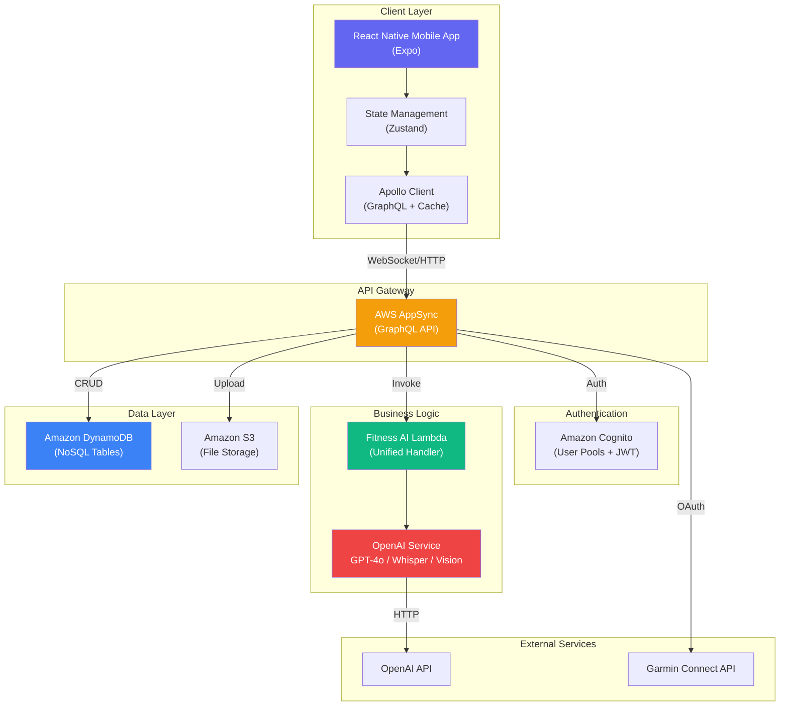
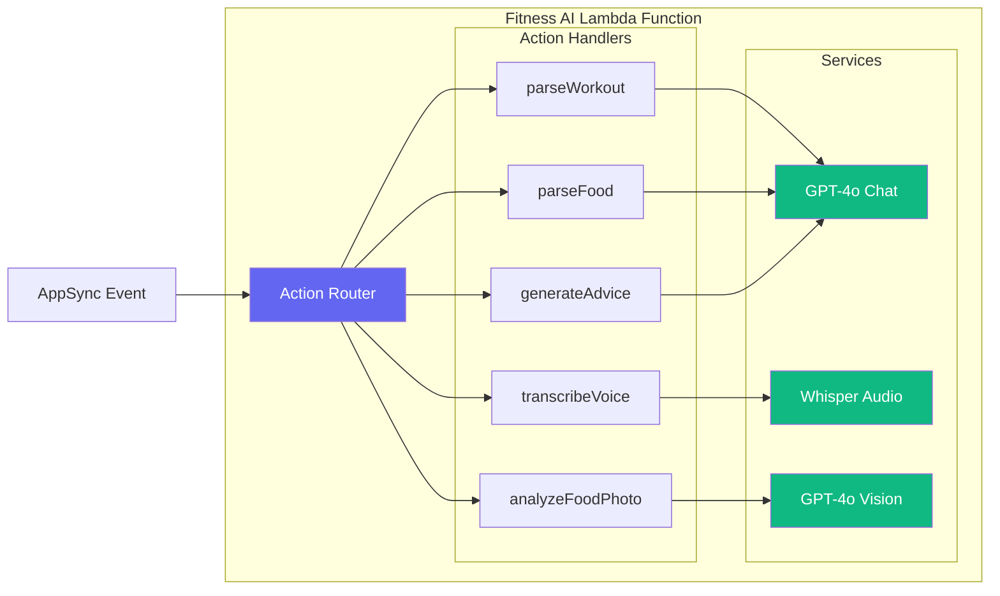
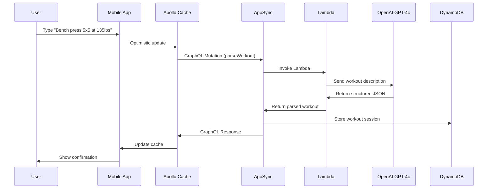
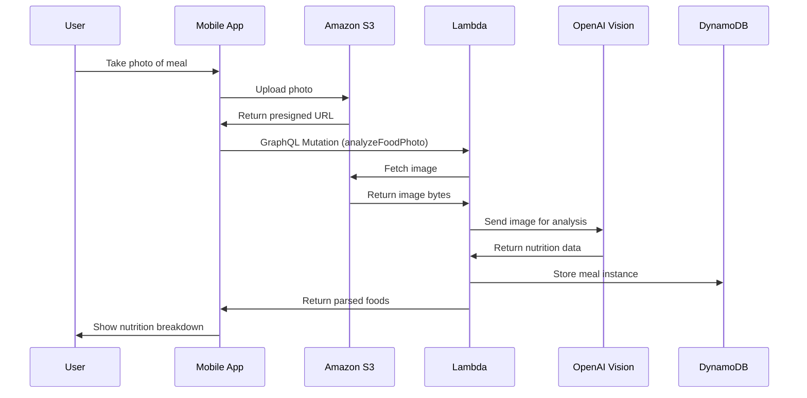
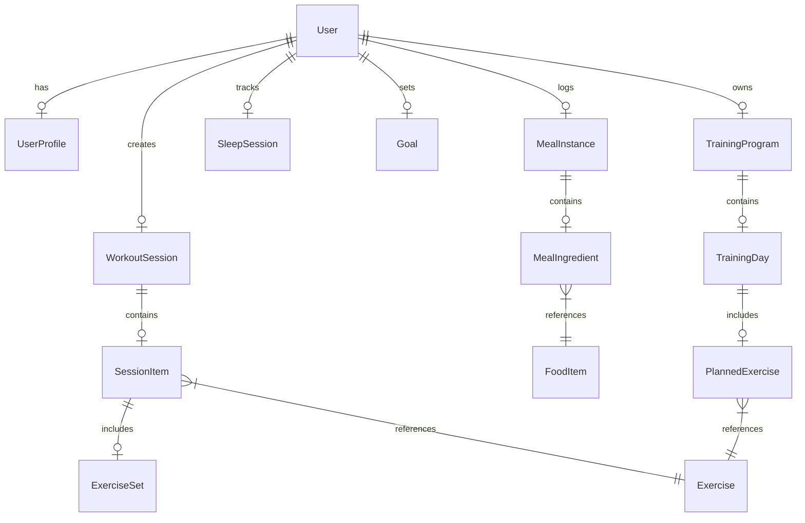

# Fitness Tracker

A comprehensive personal fitness, nutrition, and metabolism tracking application with an AI-powered chat interface. Built with React Native (Expo), AWS Amplify, and OpenAI.

## Features

| Feature | Description |
|---------|-------------|
| Chat-based Logging | Natural language input for workouts, meals, and sleep |
| Exercise Tracking | Workouts, training programs, and progress history |
| Nutrition Logging | Food database, barcode scanning, and AI photo recognition |
| Sleep Tracking | Garmin integration with automatic sync |
| AI-Powered Insights | Context-aware advice based on your data |
| Offline-First | Works without internet, syncs when connected |
| Voice Input | Hands-free logging with speech-to-text |
| Photo Analysis | Snap food photos for automatic nutrition tracking |

## System Architecture



## Lambda Function Architecture



## Data Flow: Chat-based Workout Logging



## Data Flow: Food Photo Analysis



## Database Schema



## Tech Stack

### Frontend
| Technology | Purpose |
|------------|---------|
| React Native | Cross-platform mobile framework |
| Expo | Development and build tooling |
| Expo Router | File-based navigation |
| AWS Amplify | Backend SDK integration |
| Apollo Client | GraphQL client with caching |
| Zustand | Lightweight state management |
| React Query | Server state caching |
| Expo Camera | Barcode scanning |
| Expo Audio | Voice recording |
| Expo Image Picker | Photo upload |

### Backend (AWS Serverless)
| Service | Purpose |
|---------|---------|
| AWS AppSync | GraphQL API with real-time subscriptions |
| Amazon Cognito | User authentication and authorization |
| Amazon DynamoDB | NoSQL database with on-demand scaling |
| AWS Lambda | Serverless compute for AI/ML processing |
| Amazon S3 | File storage for photos and exports |
| Amazon SNS/Pinpoint | Push notifications |

### AI/ML Services
| Service | Model | Purpose |
|---------|-------|---------|
| OpenAI Chat Completions | GPT-4o | Workout/food parsing, advice generation |
| OpenAI Audio | Whisper | Voice transcription |
| OpenAI Vision | GPT-4o | Food photo analysis |

### Development Tools
| Tool | Purpose |
|------|---------|
| pnpm | Fast, disk-efficient package manager |
| Turbo | Monorepo build orchestration |
| TypeScript | Type-safe development |
| esbuild | Fast Lambda bundling |
| Vitest | Unit testing |
| AWS Lambda Powertools | Observability (logs, traces, metrics) |

## Prerequisites

| Tool | Required For | Install |
|------|--------------|--------|
| Node.js >= 18.0.0 | All | [Download](https://nodejs.org/) |
| pnpm >= 8.0.0 | All | `npm install -g pnpm` |
| Git | All | [Download](https://git-scm.com/downloads) |
| Docker Desktop | Option B (LocalStack) | [Download](https://www.docker.com/products/docker-desktop/) |
| Expo CLI | Running app | `npm install -g expo-cli` |
| EAS CLI | iOS/Android builds | `npm install -g eas-cli` |
| AWS CLI | Option C (AWS) | [Download](https://aws.amazon.com/cli/) |
| AWS Account | Option C (AWS) | [Sign up](https://aws.amazon.com/) |
| OpenAI API Key | AI features | [Get key](https://platform.openai.com/api-keys) |

## Local Development Guide

This guide offers three ways to run the app locally, from easiest (Demo Mode) to full local backend (Docker).


## Option A: Demo Mode (No Backend, Quickest)

The fastest way to explore the app with mock data. No setup required.

```bash
# 1. Install dependencies
pnpm install

# 2. Create .env file
echo "EXPO_PUBLIC_DEMO_MODE=true" > .env

# 3. Start the app
pnpm dev
```

Then scan the QR code with Expo Go app (iOS/Android) or press `w` for web browser.


## Option B: Docker Compose (Local AWS, No Real Cloud)

Run a full local AWS stack using LocalStack. This simulates AWS services locally without needing a cloud account or API keys.

Start LocalStack

```bash
# Start LocalStack with DynamoDB, Lambda, S3, and more
docker-compose up -d

# Verify services are running
curl http://localhost:4566/_localstack/health
# Should return: {"services": {"lambda": "running", "dynamodb": "running", ...}}
```

Create a `.env` file pointing to LocalStack:

```env
# LocalStack Configuration
EXPO_PUBLIC_AWS_REGION=eu-west-1
EXPO_PUBLIC_AWS_ENDPOINT=http://localhost:4566

# LocalStack test credentials
AWS_ACCESS_KEY_ID=test
AWS_SECRET_ACCESS_KEY=test

# OpenAI (still required for AI features)
EXPO_PUBLIC_OPENAI_API_KEY=your-openai-key

# Disable demo mode to use local backend
EXPO_PUBLIC_DEMO_MODE=false
```

Deploy Resources to LocalStack

```bash
# Deploy DynamoDB tables
pnpm deploy-local
```

Start the App

```bash
pnpm dev
```

Stopping LocalStack

```bash
# Stop containers
docker-compose down

# Stop and remove volumes (wipes data)
docker-compose down -v
```


## Option C: Full Backend (AWS + OpenAI)

For full functionality with AI features, deploy the AWS backend.

### Step 1: Install Prerequisites

```bash
# Install Node.js (v18 or higher)
node --version  # Should show v18.x.x or higher

# Install pnpm if not already installed
npm install -g pnpm

# Install Amplify CLI
npm install -g @aws-amplify/cli

# Configure AWS CLI (creates credentials at ~/.aws/credentials)
aws configure
# Enter your AWS Access Key ID
# Enter your AWS Secret Access Key
# Enter default region (e.g., eu-west-1)
# Enter default output format (json)
```

### Step 2: Clone and Install

```bash
# Clone the repository
git clone https://github.com/yourusername/fitness-tracker.git
cd fitness-tracker

# Install dependencies
pnpm install
```

### Step 3: Deploy AWS Backend

```bash
# Initialize Amplify (creates amplify/backend directory)
amplify init
# ? Enter a name for the project: fitnessTracker
# ? Enter the name of the directory for your Amplify project: amplify
# ? Choose your default editor: (your preference)
# ? Choose the type of app you're building: javascript
# ? What JavaScript framework are you using: react-native
# ? Source directory path: apps/mobile
# ? Distribution directory path: (leave empty)
# ? Build command: (leave empty)
# ? Start command: npx expo start
# ? Do you want to use an AWS profile? Y
# ? Please choose the profile you want to use: (your profile name)

# Add Authentication (Cognito)
amplify add auth
# ? Do you want to use the default authentication? Default configuration
# ? How do you want users to sign in? Email
# ? Do you want to enable 3rd party authentication providers? No
# ? Do you want to add another auth resource? No

# Add API (AppSync GraphQL)
amplify add api
# ? Select from one of the below mentioned services: GraphQL
# ? Provide API name: fitnessTracker
# ? Choose the authorization type for the API: Amazon Cognito User Pool
# ? Do you have an annotated GraphQL schema? No
# ? Choose a schema template: Blank
# (Then copy the schema from amplify/backend/api/fitness-tracker/schema.graphql)

# Add Lambda Function (AI features)
amplify add function
# ? Select the function you want to add: Create a new Lambda function
# ? Provide function name: fitnessAI
# ? Choose the runtime: NodeJS
# ? Choose the function template: Hello World
# (Then the existing function code will be linked)

# Deploy everything to AWS
amplify push
# ? Are you sure you want to continue? Y
```

### Step 4: Get Your Environment Values

After deployment completes, run:

```bash
# Pull the latest configuration (creates aws-exports.js)
amplify pull
```

Open `apps/mobile/src/aws-exports.js` to see your values:

```javascript
const awsmobile = {
  aws_project_region: "eu-west-1",
  aws_cognito_identity_pool_id: "eu-west-1:xxxx-xxxx-xxxx",
  aws_cognito_region: "eu-west-1",
  aws_user_pools_id: "eu-west-1_xxxxx",
  aws_user_pools_web_client_id: "xxxxxxxxxxxx",
  aws_appsync_graphqlEndpoint: "https://xxxxx.appsync-api.eu-west-1.amazonaws.com/graphql",
  // ...
};
```

### Step 5: Get OpenAI API Key

```bash
# 1. Go to https://platform.openai.com/signup
# 2. Create account and verify email
# 3. Go to https://platform.openai.com/api-keys
# 4. Click "Create new secret key"
# 5. Copy the key (starts with sk-proj-)
```

### Step 6: Create .env File

Create a `.env` file in the root directory:

```env
# ============================================
# OpenAI API Key
# ============================================
EXPO_PUBLIC_OPENAI_API_KEY=sk-proj-your-actual-key-here

# ============================================
# AWS Configuration (from aws-exports.js)
# ============================================
EXPO_PUBLIC_AWS_REGION=eu-west-1
EXPO_PUBLIC_USER_POOL_ID=eu-west-1_xxxxx
EXPO_PUBLIC_USER_POOL_CLIENT_ID=xxxxxxxxxxxx
EXPO_PUBLIC_IDENTITY_POOL_ID=eu-west-1:xxxx-xxxx-xxxx
EXPO_PUBLIC_GRAPHQL_ENDPOINT=https://xxxxx.appsync-api.eu-west-1.amazonaws.com/graphql

# ============================================
# Optional: Garmin OAuth (for sleep tracking)
# ============================================
# EXPO_PUBLIC_GARMIN_CONSUMER_KEY=your_key
# EXPO_PUBLIC_GARMIN_CONSUMER_SECRET=your_secret
# EXPO_PUBLIC_GARMIN_CALLBACK_URL=myfitnessapp://garmin/callback

# ============================================
# Demo Mode (set to false for full backend)
# ============================================
EXPO_PUBLIC_DEMO_MODE=false
```

### Step 7: Start the App

```bash
# Start the Expo development server
pnpm dev
```

### Garmin Integration Setup (Optional)

For sleep tracking via Garmin Connect:

1. Create Garmin Developer Account
   - Go to https://developer.garmin.com/sign-up/
   - Sign up and verify your email

2. Create a New Application
   - Navigate to https://developer.garmin.com/member-applications/
   - Click "Manage" then "Create Partner App"
   - Fill in the details:
     - Application Name: Your Fitness App
     - Application Type: Mobile App or Web
     - Callback URL: `myfitnessapp://garmin/callback` (for mobile)
     - Description: Fitness tracking app with sleep sync

3. Get Your Credentials
   - After approval, you'll receive:
     - Consumer Key (API Key)
     - Consumer Secret (API Secret)

4. Add to `.env`
   ```
   EXPO_PUBLIC_GARMIN_CONSUMER_KEY=your_key_here
   EXPO_PUBLIC_GARMIN_CONSUMER_SECRET=your_secret_here
   EXPO_PUBLIC_GARMIN_CALLBACK_URL=myfitnessapp://garmin/callback
   ```

5. OAuth Flow
   - The app will redirect users to Garmin's OAuth page
   - After authorization, Garmin redirects to your callback URL with an access token
   - The token is stored securely and used to fetch sleep data


## Development

### Build Commands

```bash
# Build all packages
pnpm build

# Build specific package
pnpm --filter @fitness-tracker/mobile build
pnpm --filter @fitness-tracker/ui build
pnpm --filter @fitness-tracker/shared build

# Build Lambda function
cd amplify/backend/function/fitnessAI
npm run build
```

### Type Checking

```bash
# Type check all packages
pnpm typecheck

# Type check specific package
pnpm --filter @fitness-tracker/mobile typecheck
```

### Testing

```bash
# Run all tests
pnpm test

# Run tests with coverage
pnpm test:coverage

# Run tests in watch mode
pnpm test:watch

# Test specific package
pnpm --filter @fitness-tracker/shared test
```

### Linting

```bash
# Lint all packages
pnpm lint

# Lint and fix
pnpm lint:fix
```

## Running on Web (Without Expo)

The current setup uses Expo for all platforms. For web development, you have two options:

### Option 1: Expo Web (Current Setup)

The mobile app can run in a browser using Expo's web runtime. This is the simplest approach and works well for development.

```bash
# Start the Expo development server
pnpm --filter @fitness-tracker/mobile dev

# Then press 'w' to open in web browser
# Or visit http://localhost:8081
```

**Pros:** Same codebase for all platforms, hot reloading, works with Expo Router
**Cons:** Includes Expo SDK overhead, not optimized for production web builds

### Option 2: Pure Web Build (Vite/Next.js)

For production web builds without Expo dependencies, you can create a separate web app in `apps/web` using Vite or Next.js. This web app would:

- Use the same shared domain logic from `packages/shared`
- Use web-specific frameworks (React Router instead of Expo Router)
- Have its own optimized build pipeline
- Share the Zustand stores and business logic

**To set up a pure web app:**

```bash
# Create a new Vite + React app in apps/web
cd apps/web
pnpm create vite . --template react-ts

# Install shared dependencies
pnpm add @fitness-tracker/shared @fitness-tracker/ui zustand

# Copy/adapt stores from apps/mobile/src/lib/store.ts
# Create web-specific pages using React Router

# Run web app
cd apps/web && pnpm dev
```

**Pros:** Optimized web bundle, no Expo overhead, better SEO
**Cons:** Separate codebase to maintain, some platform-specific differences

### Project Structure for Dual Codebase

```
fitness-tracker/
├── apps/
│   ├── mobile/          # Expo app (iOS/Android + Web)
│   │   └── src/app/     # Expo Router pages
│   └── web/             # Pure web app (Vite/Next.js)
│       └── src/pages/   # React Router pages
├── packages/
│   ├── shared/          # Shared types & utilities
│   └── ui/              # Shared React components
```

Both apps consume from `packages/shared` and `packages/ui`, ensuring business logic consistency.

